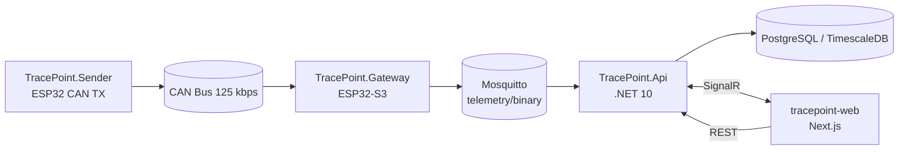

# TracePoint

CAN bus telemetry system: read frames on an ESP32, stream them over MQTT, store sessions in PostgreSQL/TimescaleDB, and view live charts plus recorded history in a web dashboard.

Built as a portfolio project to practice embedded C++, a .NET backend, and a React frontend working together on one data pipeline.

## What it does

1. A **CAN sender** (ESP32) publishes test frames on the bus.
2. A **CAN gateway** (ESP32-S3) reads frames, buffers them when WiFi is down, and sends binary batches over MQTT when online.
3. The **API** subscribes to MQTT, decodes signals using uploaded DBC files, pushes live data through SignalR, and writes recorded sessions to the database.
4. The **web app** shows a live chart, lets you start/stop recording, and opens past sessions in an analytics view with zoom and shareable URLs.

## Architecture



## Tech stack

| Layer | Technologies |
|-------|--------------|
| Firmware | C++, Arduino, PlatformIO, ESP32 / ESP32-S3, TWAI CAN, PubSubClient |
| Backend | ASP.NET Core, SignalR, MQTTnet, EF Core, Dapper, MediatR, DbcParserLib |
| Database | PostgreSQL with TimescaleDB (`time_bucket` for downsampling) |
| Frontend | Next.js 16, React 19, TypeScript, Tailwind CSS, uPlot, SignalR client |
| Messaging | Mosquitto MQTT broker |

Each main component has its own README with setup details:

- [Backend (`TracePoint.Api`)](src/TracePoint.Api/README.md)
- [Frontend (`tracepoint-web`)](src/tracepoint-web/README.md)
- [Firmware (`Gateway` + `Sender`)](src/TracePoint.Gateway/README.md)

## Prerequisites

- [.NET 10 SDK](https://dotnet.microsoft.com/download)
- [Node.js 20+](https://nodejs.org/)
- [Docker](https://www.docker.com/) (PostgreSQL/TimescaleDB and optional pgAdmin)
- [Mosquitto](https://mosquitto.org/) MQTT broker on port `1883`
- [PlatformIO](https://platformio.org/) (only if you work with the ESP32 boards)

## Quick start

### 1. Database

Start the local database container (adjust names if yours differ):

```bash
docker start tracepoint-db
# optional UI:
docker start pgadmin-dashboard
```

Default connection (see `src/TracePoint.Api/appsettings.json`):

- Host: `localhost`, port: `5432`
- Database: `tracepoint`
- User / password: `postgres` / `postgres`

Apply migrations from the API project:

```bash
cd src/TracePoint.Api
dotnet ef database update
```

### 2. MQTT broker

Run Mosquitto locally on port `1883`. The gateway publishes to topic `telemetry/binary`.

### 3. Backend

```bash
cd src/TracePoint.Api
dotnet run
```

API listens on `http://localhost:5247` (see `Properties/launchSettings.json`).

### 4. Frontend

```bash
cd src/tracepoint-web
npm install
npm run dev
```

Open [http://localhost:3000](http://localhost:3000).

### 5. Hardware (optional)

Flash **Sender** and **Gateway** with PlatformIO, wire CAN TX/RX (125 kbps), and set WiFi/MQTT targets in the gateway firmware. See the [firmware README](src/TracePoint.Gateway/README.md).

Without boards, you can run `TracePoint.Simulator` to push mock measurements into SignalR:

```bash
cd src/TracePoint.Simulator
dotnet run
```

## Local dev notes

**Serial monitor** (Linux example):

```bash
pio device monitor --port /dev/serial/by-id/usb-Espressif_USB_JTAG_serial_debug_unit_* --baud 115200
```
